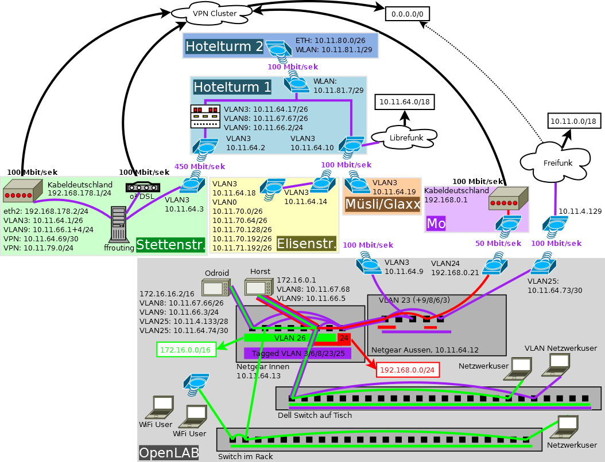

# Labnetz-Doku #

## Dieses Dokument ##

Die Dokumente in diesem Repository beschreiben den Stand des Labornetzes vom 29.1.2015, sowie einigen Änderungen die zum 21.09.2015 eingetreten sind.

## Ziele ##

Das Labor soll zuverlässig an das Internet angebunden sein. Geräte und Infrastruktur sollen aus dem lokalen Netz erreichbar sein.

## Netz ##

### Internet ###

Das Labor wird im Normfall über Moritz' Wohnung an das Internet angebunden, im Fehlerfall ist auch eine Umleitung über pRiVi möglich sowie die Freifunkanbindung.

Damit das Labor nach außen hin nicht unter Mo's privater IP-Adresse surft, wird jeglicher Internettraffic, den das Lab erzeugt, durch einen VPN-Tunnel geleitet.

## Neuordnung 21.09.2015 ##

Zum 21.09.2015 wurde folgender Zustand erreicht. Die genauere Beschreibung folgt noch.



### heinrich (defendo) ###

Der Zentrale Router (heinrich/defendo) hat 4 Ethernet-Interfaces:
  * eth0 führt (auf Umwegen) zu Moritz' Modem
  * an eth1 wird DHCP ausgegeben, hier werden auch die Clients verbunden

Auf dem Interface `eth0` VLANs an:
  * `14` zu Moritz
  * `8` zum Hotelturm

Da das Default-VLAN uns hier nicht weiterhilft, muss das Modul `8021q` geladen sein, was in der `/etc/modules` vermerkt ist.

Damit weiterhin nicht automatisch Moritz' Router als Default-Route auf heinrich gepushed wird, ist in der `/etc/dhcp/dhclient.conf` in der mit `request` beginnenden Zeile der Parameter `routers` entfernt.

#### Configs ####

  * `/etc/dhcp/dhclient.conf` [link](heinrich/etc/dhcp/dhclient.conf)
  * `/etc/network/interfaces` [link](heinrich/etc/network/interfaces)
  * `/etc/openvpn/client.conf` [link](heinrich/etc/openvpn/client.conf)
  * `/etc/iptables/rules.v4` [link](heinrich/etc/iptables/rules.v4)

#### exit ####

exit macht outbound NAT.

#### configs ####

  * `/etc/openvpn/server.conf` [link](exit/etc/openvpn/server.conf)

### APs (TP-Link WR841ND) ###

Sind als "dumme" Access-Points konfiguriert, d.h. sie setzen einfach das LAN auf WLAN um.

SSIDs:
  * Labor 2.0 - Passphrase ist allgemein bekannt.


## Numbering ##

IP Range: `172.16.0.1/16`

Reserved/Fixed IPs:
  * `172.16.0.1` Gateway (defendo)
  * `172.16.0.5` Drucker Kyocera FS-1020D
  * `172.16.0.10` AP Nordseite
  * `172.16.0.11` AP Südseite
  * `172.16.16.1` rantanplan

VMs auf Rantanplan:
`172.16.16.%i % ct_id` (`100 <= ct_id < 255`)

```
      CTID      NPROC STATUS    IP_ADDR         HOSTNAME
       100         30 running   172.16.16.100   mpd.ffa
       104         41 running   172.16.16.104   rantanftp.ffa
       105         96 running   172.16.16.105   moritz.ffa
       106         14 running   172.16.16.106   kasse.ffa
       107         18 running   172.16.16.107   sphincter.ffa
       108         10 running   172.16.16.108   waaaaargh.ffa
       109         25 running   172.16.16.109   fileshare.ffa
       112         19 running   172.16.16.112   flypps.openlab.lan
       113         92 running   172.16.16.113   labapi.ffa
       114         13 running   172.16.16.114   irc
       115         14 running   172.16.16.115   glaxx
       116         15 running   172.16.16.116   beehive.ffa
       117          9 running   172.16.16.117   inventory.ffa
       118         21 running   172.16.16.118   print.openlab.lan
       119         35 running   172.16.16.119   lsmsd.openlab.lan
```

DHCP Range for clients:
  * `172.16.0.50 - 172.16.0.254`
 
Not in Range:
  * `10.90.90.90`: Switch D-Link
